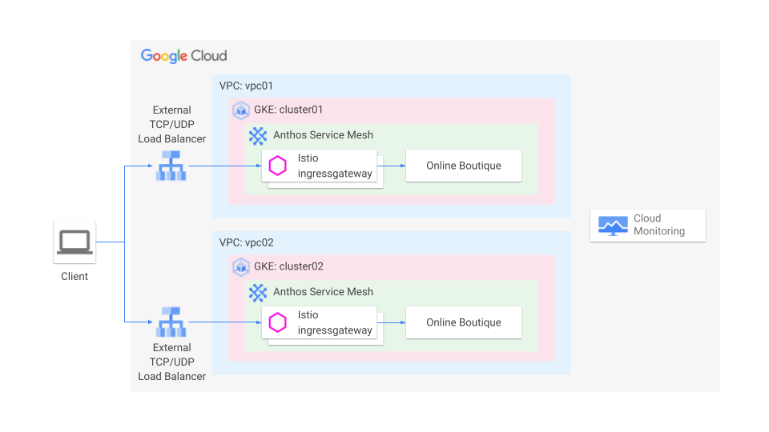

# Anthos Service Mesh Monitoring Check

Deploy online boutique applications per GKE cluster to a brand new Google Cloud project to see how ASM dashboard and Cloud Monitoring work.

## Assumption

- You have a brand new Google Cloud project with billing enabled.
- You run a script in Google Cloud Shell.

## Diagram



## What the script does?

1. Set a default project
1. Enable required APIs
1. Create two VPCs for GKE clusters
1. Create two GKE clusters
1. Get authentication credentials of GKE clusters
1. Download asmcli
1. Install Anthos Service Mesh per cluster
1. Deploy istio ingress-gateway per cluster
1. Deploy Online Boutique applications per cluster

## Steps

1. Clone the repo on Cloud Shell

   ```bash
   git clone http://github.com/hasebe/asm-monitoring-check.git
   ```

1. Change current directory to the repository

   ```bash
   cd asm-monitoring-check
   ```

1. Run the script

   ```bash
   bash build_environment.sh
   ```

   It takes around 20 minutes to complete.

## Clean up

1. Delete the project to remove all resources running on the project.

   ```bash
   gcloud projects delete ${PROJECT_ID}
   ```

1. Unset contexts for kubectl

   ```bash
   kubectl config unset contexts.cluster01
   kubectl config unset contexts.cluster02
   ```
